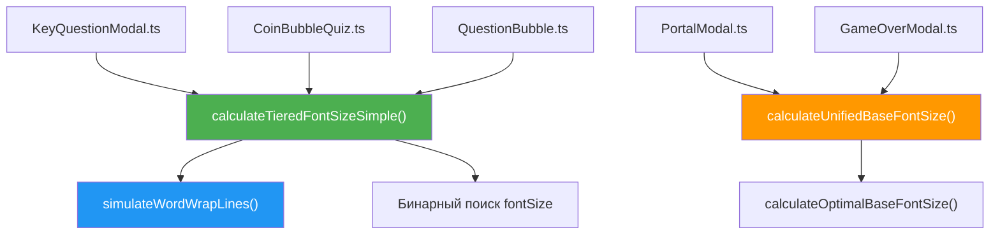

# Система динамического расчёта размеров шрифтов

## Версия: 3.1
## Последнее обновление: 2026-02-16

---

## Обзор

Система расчёта шрифтов обеспечивает автоматический подбор максимально крупного шрифта для текстовых элементов, гарантируя, что текст полностью помещается в отведённую область при любом соотношении сторон экрана.

**Ключевые особенности v3.0:**
- ✅ **Бинарный поиск максимального fontSize** — шрифт всегда максимально крупный
- ✅ **Пословная симуляция wordWrap** — точный подсчёт строк (как Phaser)
- ✅ **Без ограничения по строкам** — адаптивное число строк вместо агрессивного уменьшения
- ✅ **Единственная настраиваемая константа** — `LINE_HEIGHT_RATIO`
- ✅ **Чистая арифметика** — без создания Phaser-объектов для расчёта

---

## Архитектура

### Компоненты системы



| Компонент | Функция | Статус |
|-----------|---------|--------|
| **KeyQuestionModal** | `calculateTieredFontSizeSimple` | ✅ **Новая система v3** (общая) |
| **CoinBubbleQuiz** | `calculateTieredFontSizeSimple` | ✅ **Новая система v3** (общая) |
| **QuestionBubble** | `calculateTieredFontSizeSimple` | ✅ **Новая система v3** (общая) |
| **PortalModal** | `calculatePortalTieredFontSize` | ✅ **Новая система v3** (изолированная копия) |
| **GameOverModal** | `calculateGameOverTieredFontSize` | ✅ **Новая система v3** (изолированная копия) |

> **Примечание:** `calculatePortalTieredFontSize` и `calculateGameOverTieredFontSize` — это **изолированные копии** функции `calculateTieredFontSizeSimple` с идентичной логикой бинарного поиска. Они созданы для независимости этих модальных окон от общих утилит.

### Файловая структура

| Файл | Назначение |
|------|-----------|
| [FontSizeCalculator.ts](file:///d:/WORK_offline/FREEenv/GameDev/ArcadeQuiz/ArcadeQuiz/src/game/utils/FontSizeCalculator.ts) | Все функции расчёта шрифтов |
| [textStyles.ts](file:///d:/WORK_offline/FREEenv/GameDev/ArcadeQuiz/ArcadeQuiz/src/constants/textStyles.ts) | Константы стилей, цветов, множителей |
| [ModalSizeCalculator.ts](file:///d:/WORK_offline/FREEenv/GameDev/ArcadeQuiz/ArcadeQuiz/src/game/ui/ModalSizeCalculator.ts) | Расчёт размеров модальных окон (7 диапазонов AR) |
| [KeyQuestionModal.ts](file:///d:/WORK_offline/FREEenv/GameDev/ArcadeQuiz/ArcadeQuiz/src/game/ui/KeyQuestionModal.ts) | Модальное окно вопросов по ключам |
| [CoinBubbleQuiz.ts](file:///d:/WORK_offline/FREEenv/GameDev/ArcadeQuiz/ArcadeQuiz/src/game/ui/CoinBubbleQuiz.ts) | Бабблы монетного квиза |
| [QuestionBubble.ts](file:///d:/WORK_offline/FREEenv/GameDev/ArcadeQuiz/ArcadeQuiz/src/game/ui/QuestionBubble.ts) | Бабблы вопросов оракула |

---

## Алгоритм: `calculateTieredFontSizeSimple`

### Принцип

Функция находит **максимальный fontSize**, при котором текст с пословным переносом **полностью помещается** по высоте в отведённое поле.

### Формула проверки (для каждого кандидата fontSize)

```
charsPerLine = floor(fieldWidth / (fontSize × CHAR_WIDTH_RATIO))
lines = simulateWordWrapLines(text, charsPerLine)
totalHeight = lines × fontSize × LINE_HEIGHT_RATIO

Условие: totalHeight ≤ fieldHeight → fontSize подходит ✅
```

### Бинарный поиск

```typescript
// FontSizeCalculator.ts — ядро алгоритма
export function calculateTieredFontSizeSimple(
  fieldWidth: number,    // Ширина текстовой области (нативные px)
  fieldHeight: number,   // Высота текстовой области (нативные px)
  longestText: string,   // Полный текст (для wordWrap-симуляции)
  charWidthRatio: number = CHAR_WIDTH_RATIO_SANS
): number {
  let lo = MIN_FONT_SIZE_BUTTON;  // нижняя граница (10px)
  let hi = Math.min(fieldHeight, MAX_OPTIMAL_FONT_SIZE);  // верхняя (72px)
  let bestSize = lo;

  while (hi - lo > 0.5) {         // точность 0.5px
    const mid = (lo + hi) / 2;
    const charsPerLine = Math.floor(fieldWidth / (mid * charWidthRatio));
    const lines = simulateWordWrapLines(longestText, charsPerLine);
    const totalHeight = lines * mid * LINE_HEIGHT_RATIO;

    if (totalHeight <= fieldHeight) {
      bestSize = mid;  // влезает — пробуем крупнее
      lo = mid;
    } else {
      hi = mid;         // не влезает — пробуем мельче
    }
  }

  return Math.min(bestSize, MAX_OPTIMAL_FONT_SIZE);
}
```

### Изолированные копии функции

Некоторые модальные окна используют **изолированные копии** функции бинарного поиска:

```typescript
// Изолированные копии в FontSizeCalculator.ts
export function calculatePortalTieredFontSize(
  fieldWidth: number,
  fieldHeight: number,
  longestText: string,
  charWidthRatio: number = CHAR_WIDTH_RATIO_SANS
): number { /* идентичная логика */ }

export function calculateGameOverTieredFontSize(
  fieldWidth: number,
  fieldHeight: number,
  longestText: string,
  charWidthRatio: number = CHAR_WIDTH_RATIO_SANS
): number { /* идентичная логика */ }
```

**Назначение изолированных копий:**
- Независимость PortalModal и GameOverModal от изменений в общей функции
- Возможность тонкой настройки для конкретного модального окна

> **Примечание:** Все три функции (`calculateTieredFontSizeSimple`, `calculatePortalTieredFontSize`, `calculateGameOverTieredFontSize`) используют **идентичную** логику бинарного поиска.

### Пословная симуляция wordWrap

Phaser переносит текст **по словам**, а не по символам. Длинное слово, которое не помещается в остаток строки, целиком переносится на новую строку.

```typescript
// Пример: charsPerLine = 12
// "Тест правильный длинный"
// Строка 1: "Тест" (4 символа, остаток = 7)
// "правильный" (10 символов) > остаток (7) → ПЕРЕНОС!
// Строка 2: "правильный" (10 символов, остаток = 1)
// "длинный" (7 символов) > остаток (1) → ПЕРЕНОС!
// Строка 3: "длинный"
// Итого: 3 строки (а не ceil(22/12) = 2!)
```

---

## Настраиваемые параметры

### Константы в `FontSizeCalculator.ts`

| Константа | Текущее значение | Эффект при увеличении | Эффект при уменьшении |
|-----------|------------------|----------------------|----------------------|
| `LINE_HEIGHT_RATIO` | **1.55** | ↓ Меньше шрифт, больше межстрочный интервал | ↑ Крупнее шрифт, строки теснее |
| `CHAR_WIDTH_RATIO_SANS` | **0.45** | Считает символы шире → меньше в строке → больше строк | Считает символы уже → больше в строке |
| `CHAR_WIDTH_RATIO_MONO` | **0.50** | То же, для monospace шрифтов | То же |
| `MAX_OPTIMAL_FONT_SIZE` | **72** | Потолок максимального шрифта | Потолок |
| `MIN_FONT_SIZE_BUTTON` | **10** | Минимальный допустимый шрифт | Минимальный |

### Как менять `LINE_HEIGHT_RATIO`

```typescript
// FontSizeCalculator.ts, строка ~400
const LINE_HEIGHT_RATIO = 1.55;  // Текущее значение
```

**Типичные значения:**
- `1.2` — плотные строки, крупный шрифт
- `1.4` — сбалансированно
- `1.55` — просторные строки, мельче шрифт

> [!TIP]
> `LINE_HEIGHT_RATIO` — **единственная** константа, которая влияет на размер шрифта во всех компонентах одновременно.

---

## Использование в компонентах

### KeyQuestionModal

Рассчитывает **3 независимых fontSize**: для вопроса, фидбэка и кнопок.

```typescript
// KeyQuestionModal.ts — метод createUI()

// 1. Получаем нативные размеры текстовой области
const invZoom = 1 / this.scene.cameras.main.zoom;
const nativeAvailableWidth = blockAvailableWidth / invZoom;
const nativeAvailableHeight = blockAvailableHeight / invZoom;

// 2. Рассчитываем fontSize для каждого элемента
const questionFontSize = calculateTieredFontSizeSimple(
  nativeAvailableWidth,
  nativeAvailableHeight,
  longestTexts.question           // ← полный текст, НЕ .length!
);

const feedbackFontSize = calculateTieredFontSizeSimple(
  nativeAvailableWidth,
  nativeAvailableHeight,
  longestTexts.feedback,
  CHAR_WIDTH_RATIO_MONO           // monospace шрифт
);

const buttonFontSize = calculateTieredFontSizeSimple(
  nativeAvailableWidth,
  nativeAvailableHeight,
  longestTexts.answer
);
```

> [!IMPORTANT]
> В функцию передаётся **полный текст** (строка), а не `.length`. Это необходимо для корректной пословной симуляции wordWrap.

### CoinBubbleQuiz

Рассчитывает **один fontSize** для обоих бабблов.

```typescript
// CoinBubbleQuiz.ts — метод applyFontSize()

// 1. Учитываем монетку (80px на иконку и отступ)
const COIN_OFFSET_SPACE = 80;
const textAvailableWidthForCalc = bubbleAvailableWidth - COIN_OFFSET_SPACE;

// 2. Пересчитываем в нативные координаты
const invZoom = 1 / this.scene.cameras.main.zoom;
const nativeTextWidth = textAvailableWidthForCalc / invZoom;
const nativeTextHeight = bubbleAvailableHeight / invZoom;

// 3. Рассчитываем fontSize по самому длинному тексту из двух бабблов
const fontSize = calculateTieredFontSizeSimple(
  nativeTextWidth,
  nativeTextHeight,
  longestText,             // max(bubble1Text, bubble2Text) по длине
  CHAR_WIDTH_RATIO_SANS
);
```

### QuestionBubble

Рассчитывает **глобальный fontSize** (кешируется для всех бабблов уровня).

```typescript
// QuestionBubble.ts — конструктор

// 1. Виртуальные размеры → нативные
const availableWidth = this.TEXT_AREA_WIDTH * this.scale;
const availableHeight = this.TEXT_AREA_HEIGHT * this.scale;
const invZoom = 1 / scene.cameras.main.zoom;
const nativeAvailableWidth = availableWidth / invZoom;
const nativeAvailableHeight = availableHeight / invZoom;

// 2. Кешированный расчёт
if (globalBubbleFontSize !== null) {
  optimalFontSize = globalBubbleFontSize;  // уже рассчитан
} else {
  optimalFontSize = calculateTieredFontSizeSimple(
    nativeAvailableWidth,
    nativeAvailableHeight,
    longestQuestionText,
    CHAR_WIDTH_RATIO_SANS
  );
  globalBubbleFontSize = optimalFontSize;  // сохраняем для всех бабблов
}
```

---

## Пересчёт в нативные координаты

Текст рендерится с `setScale(invZoom)` для чёткости. Поэтому **wordWrap и fontSize** работают в нативных координатах, а размеры блоков — в виртуальных. Перед расчётом нужно пересчитать:

```
nativeWidth  = virtualWidth  / invZoom
nativeHeight = virtualHeight / invZoom

// где invZoom = 1 / scene.cameras.main.zoom (обычно 0.625)
```

> [!CAUTION]
> Если передать виртуальные координаты вместо нативных, шрифт будет **в ~1.6 раз** крупнее ожидаемого и выйдет за границы блока.

---

## Автоматическая адаптация к ширине экрана

Алгоритм **автоматически подстраивается** — специальных таблиц или констант для разных экранов **не требуется**:

| Размер экрана | fieldWidth | Поведение |
|---------------|-----------|-----------|
| **Широкий** (монитор) | Большая | Мало строк → крупный шрифт |
| **Средний** (планшет) | Средняя | Больше строк → тот же или чуть меньше шрифт |
| **Узкий** (мобильный) | Маленькая | Много строк → шрифт меньше, но **максимально возможный** |

Это достигается без каких-либо `if/else` по aspect ratio — бинарный поиск сам находит оптимум.

---

## Примеры настройки

### Увеличить шрифт при тех же размерах блока

Уменьшить `LINE_HEIGHT_RATIO` — строки будут теснее, но шрифт крупнее:

```diff
- const LINE_HEIGHT_RATIO = 1.55;
+ const LINE_HEIGHT_RATIO = 1.3;
```

### Изменить шрифт только для CoinBubbleQuiz

Изменить `COIN_OFFSET_SPACE` — выделить больше/меньше места под текст:

```diff
// CoinBubbleQuiz.ts, метод applyFontSize()
- const COIN_OFFSET_SPACE = 80;
+ const COIN_OFFSET_SPACE = 50;  // Больше места для текста → крупнее шрифт
```

### Изменить оценку ширины символов

Если шрифт **шире** среднего (например, кириллица в bold):

```diff
- export const CHAR_WIDTH_RATIO_SANS = 0.45;
+ export const CHAR_WIDTH_RATIO_SANS = 0.50;  // Шрифт считается шире → меньше charsPerLine
```

### Ограничить максимальный шрифт

```diff
- const MAX_OPTIMAL_FONT_SIZE = 72;
+ const MAX_OPTIMAL_FONT_SIZE = 50;  // Потолок 50px вместо 72px
```

---

## Логирование

При каждом расчёте шрифта выводится лог:

```
📏 FontAuto: 42.5px, 3 строк (charsPerLine=14, textLen=48, fieldW=280, fieldH=200)
```

| Поле | Значение |
|------|---------|
| `FontAuto` | Результат бинарного поиска |
| `42.5px` | Найденный оптимальный fontSize |
| `3 строк` | Количество строк после wordWrap |
| `charsPerLine=14` | Символов в строке при этом fontSize |
| `textLen=48` | Длина текста |
| `fieldW=280` | Ширина поля (нативные px) |
| `fieldH=200` | Высота поля (нативные px) |

---

## Связанные документы

| Документ | Содержание |
|----------|-----------|
| [MODAL_GUIDE.md](file:///d:/WORK_offline/FREEenv/GameDev/ArcadeQuiz/ArcadeQuiz/documentation/main/ui/MODAL_GUIDE.md) | Общее руководство по модальным окнам |
| [UI_COMPONENTS.md](file:///d:/WORK_offline/FREEenv/GameDev/ArcadeQuiz/ArcadeQuiz/documentation/main/ui/UI_COMPONENTS.md) | Компоненты UI (кнопки, NineSlice) |
| [BUBBLE_SYSTEM.md](file:///d:/WORK_offline/FREEenv/GameDev/ArcadeQuiz/ArcadeQuiz/documentation/main/game-systems/BUBBLE_SYSTEM.md) | Система бабблов |

---

## История изменений

### Версия 3.1 (2026-02-16)
- ✅ **Добавлено описание изолированных функций** — `calculatePortalTieredFontSize` и `calculateGameOverTieredFontSize`
- ✅ **Обновлена таблица компонентов** — пометка "(изолированная копия)" для PortalModal и GameOverModal
- ✅ **Синхронизация с MODAL_GUIDE.md v3.0** — единое описание системы

### Версия 3.0 (2026-02-15)
- ✅ **Бинарный поиск** вместо `calculateOptimalBaseFontSize` с Phaser temp-объектами
- ✅ **Пословная симуляция wordWrap** (`simulateWordWrapLines`) вместо `ceil(textLen/charsPerLine)`
- ✅ **Без ограничения по строкам** — автоматическая адаптация
- ✅ **Чистая арифметика** — без зависимости от Phaser runtime
- ✅ **Нативные координаты** — корректная компенсация `invZoom`
- ✅ **CoinBubbleQuiz переведён** на `calculateTieredFontSizeSimple`
- ❌ Удалены: система адаптивных множителей (`getFontSizeMultiplier`), таблица 7 диапазонов AR для шрифтов, трёхуровневая система (IDEAL/EXPANDED/REDUCED)

### Версия 2.0 (2026-02-06)
- Система 7 диапазонов aspect ratio
- Адаптивные множители шрифтов (1.26–1.54)
- Единый базовый размер для всех элементов

### Версия 1.0 (2025-12-05)
- Создание системы динамического расчёта
- Гибридный подход (build-time + runtime)
